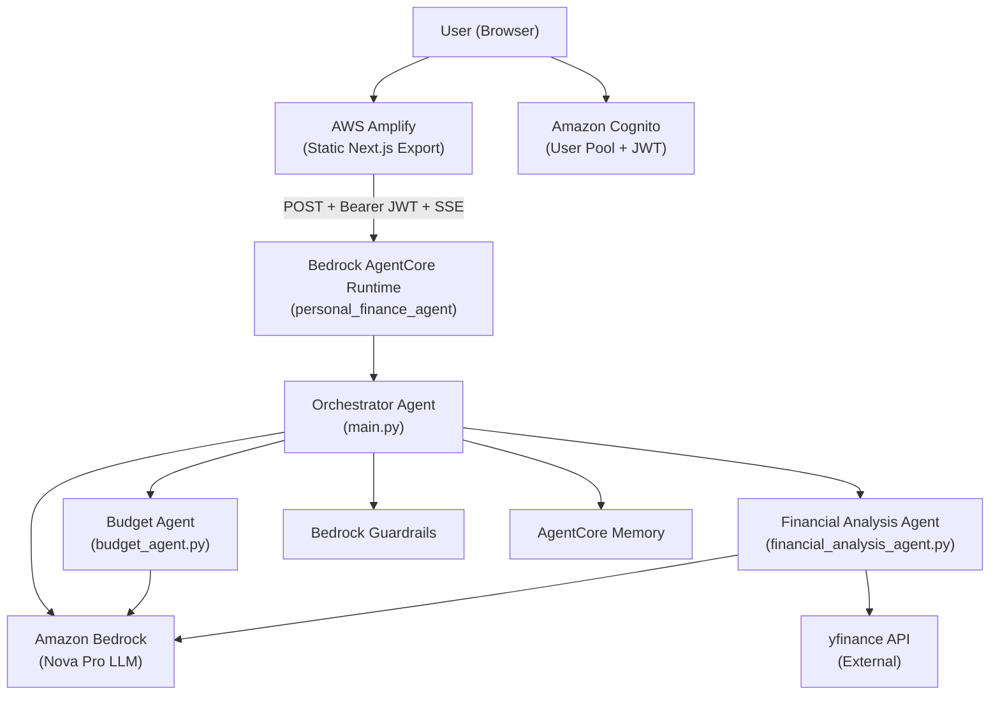
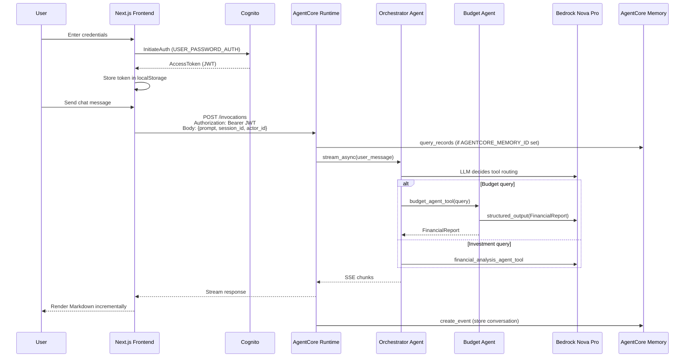
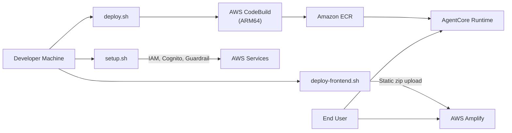

# Project Architecture

## 1. Executive Summary

**Verified from code:** This repository implements **NovaMind AI Financial Advisor** — an AI-powered, multi-agent personal finance assistant built for a **NEXT Insurance / CloudAge POC**. Users interact through a **Next.js chat UI** hosted on **AWS Amplify**. Authenticated requests are sent to an **Amazon Bedrock AgentCore Runtime** container that runs a Python **orchestrator agent** (Strands Agents SDK). The orchestrator delegates to two specialist agents: a **Budget Agent** (50/30/20 budgeting, structured Pydantic reports) and a **Financial Analysis Agent** (stock research via yfinance, portfolio recommendations, stock comparisons).

The system demonstrates a progressive architecture: single agent → multi-agent orchestration → production cloud deployment with Cognito auth, Bedrock Guardrails, AgentCore Memory, streaming responses, and observability.

**Project type:** Conversational AI platform (POC), not a traditional CRUD web application.

---

## 2. What This Project Solves

**Verified from `PreSalesTeam/Client_Requirements.md` and `.kiro/steering/product.md`:**

The client needed a **production-ready demonstration** of Amazon Bedrock and the Strands Agents SDK for financial advisory use cases. The POC proves that:

1. A single-purpose budget agent can be built with guardrails, tools, structured output, and streaming.
2. Multiple specialized agents can collaborate under an orchestrator using the **Agents as Tools** pattern.
3. The full stack can be deployed to **Amazon Bedrock AgentCore Runtime** with authentication, memory, and observability.

**Inferred from implementation:** The long-term product vision (documented in `Solutions_Architect/Prerequisites_for_Production.md`) is to replace financial agents with **insurance-domain agents** (underwriting, claims, policy, compliance, customer service) for NEXT Insurance — a digital-first SMB insurance carrier.

---

## 3. Business Context

| Aspect | Detail |
|--------|--------|
| Client / sponsor | NEXT Insurance (ERGO NEXT Insurance), powered by CloudAge |
| Project phase | POC / demonstration platform |
| Delivery model | Three phases: Single Agent → Multi-Agent → Production Deployment |
| Production roadmap | Insurance-specific agents, SOC 2, multi-tenancy, IaC, real data integrations |

**Verified from code:** Frontend branding references NEXT Insurance, CloudAge, and "Built by Aamir" (`frontend/pages/index.tsx`, `LoginForm.tsx`).

---

## 4. Target Users

**Verified from requirements and UI:**

- **Primary:** End users seeking conversational financial guidance (budgeting, spending analysis, investment research).
- **Secondary:** CloudAge / NEXT Insurance stakeholders evaluating the AI platform architecture for future insurance use cases.
- **Operational:** Administrators who provision Cognito users (admin-only user creation — no self-registration).

**Not identifiable from the repository:** Production user volume, geographic distribution, or real customer onboarding flows.

---

## 5. Core Features

| Feature | Implementation |
|---------|----------------|
| Budget planning (50/30/20 rule) | `budget_agent.py` → `calculate_budget` tool |
| Spending analysis & financial health score | Budget agent with Pydantic `FinancialReport` structured output |
| Pie chart generation | `create_financial_chart` tool (matplotlib) |
| Stock analysis (real-time) | `financial_analysis_agent.py` → `get_stock_analysis` via yfinance |
| Portfolio recommendations | `create_diversified_portfolio` (conservative/moderate/aggressive) |
| Multi-stock comparison | `compare_stock_performance` (up to 5 symbols) |
| Intelligent query routing | Orchestrator in `main.py` selects specialist agent(s) |
| Multi-agent synthesis | Orchestrator combines budget + investment responses |
| Streaming chat responses | SSE from AgentCore → frontend `agent.ts` |
| Content safety guardrails | Bedrock Guardrail blocks crypto/Bitcoin advice |
| Cross-session memory | AgentCore Memory via `MemoryClient` in `main.py` |
| User authentication | Amazon Cognito JWT (USER_PASSWORD_AUTH) |
| Conversation summarization | `SummarizingConversationManager` on orchestrator |

---

## 6. Technology Stack

Only technologies **actually used in application code** are listed below.

### Backend

| Technology | Where Used | Responsibility |
|------------|------------|----------------|
| Python 3.12 | All backend modules | Agent runtime, tools, AWS integration |
| Strands Agents SDK (`strands`) | `main.py`, `budget_agent.py`, `financial_analysis_agent.py` | Agent definition, `@tool` decorator, streaming, structured output |
| `strands-agents-tools` | `budget_agent.py` | Built-in `calculator` tool |
| Amazon Bedrock (Nova Pro) | All agents via `BedrockModel` | LLM inference (`amazon.nova-pro-v1:0`, temperature 0.0) |
| `bedrock-agentcore` | `main.py` | `BedrockAgentCoreApp`, entrypoint, container hosting |
| `bedrock-agentcore-starter-toolkit` | `deploy.sh` | Runtime configuration and deployment |
| Pydantic v2 | `budget_agent.py` | `FinancialReport`, `BudgetCategory` schema validation |
| yfinance | `financial_analysis_agent.py` | Real-time stock data |
| matplotlib | `budget_agent.py` | Pie chart generation |
| boto3 | Utils, deployment scripts | Cognito, Secrets Manager, Guardrails, AgentCore control plane |
| OpenTelemetry | `Dockerfile` CMD | Production observability (`opentelemetry-instrument`) |
| uv | `Dockerfile` | Container dependency installation |

### Frontend

| Technology | Where Used | Responsibility |
|------------|------------|----------------|
| Next.js 12.3.4 | `frontend/` | Pages router, static export for Amplify |
| React 18.2 | Components | UI rendering |
| TypeScript 5.3 | All frontend source | Type safety |
| react-markdown | `ChatMessage.tsx` | Render assistant responses as Markdown |
| Custom CSS | `styles/globals.css` | Styling (no Tailwind/component library) |
| Fetch API | `auth.ts`, `agent.ts` | Cognito auth + SSE streaming to AgentCore |

### AWS Infrastructure

| Service | Where Used | Responsibility |
|---------|------------|----------------|
| Bedrock AgentCore Runtime | `main.py`, `.bedrock_agentcore.yaml` | Serverless container hosting for orchestrator |
| Amazon Bedrock Guardrails | `utils/guardrail.py`, orchestrator model config | Content safety (crypto/Bitcoin blocking) |
| Amazon Cognito | `utils/agentcore_utils.py`, `auth.ts` | User pool, JWT authentication |
| AWS Secrets Manager | `agentcore_utils.py` | Store Cognito credentials |
| Amazon ECR | `.bedrock_agentcore.yaml` | Container image registry |
| AWS CodeBuild | Deployment via starter toolkit | ARM64/Graviton image builds |
| AWS Amplify | `deploy-frontend.sh`, `amplify.yml` | Static frontend hosting |
| CloudWatch | AgentCore observability config | Logging and monitoring |
| AgentCore Memory | `main.py` (`MemoryClient`) | Cross-session conversation persistence |
| IAM | `setup.sh`, `.bedrock_agentcore.yaml` | Execution roles for AgentCore and CodeBuild |

### Not Present in Repository

- Traditional database (PostgreSQL, DynamoDB, etc.)
- ORM (SQLAlchemy, Prisma, etc.)
- REST/GraphQL API framework (FastAPI, Express) — AgentCore replaces this layer
- Automated test frameworks (pytest, Jest)
- IaC (Terraform, CDK, CloudFormation templates)
- CI/CD pipeline configuration (GitHub Actions, etc.)
- Message brokers / job queues

---

## 7. High-Level Architecture

The system follows a **multi-agent orchestration pattern** deployed as a **serverless AI runtime** with a **static SPA frontend**.



**Architectural pattern (verified from code):**
- **Multi-agent orchestration** (Agents as Tools)
- **Layered separation**: UI → Auth → Runtime entrypoint → Orchestrator → Specialist agents → LLM/Tools
- **Event-driven streaming** (async generator yields SSE chunks)
- **Not** microservices — single container with internal agent delegation
- **Not** MVC — no controllers/models/views in the traditional sense

---

## 8. Architecture Diagram — Request Flow



---

## 9. Project Folder Structure

```text
StrandsMultiAgent/
├── PreSalesTeam/
│   └── Client_Requirements.md          → Full 3-phase requirements spec
├── Solutions_Architect/
│   └── Prerequisites_for_Production.md → POC → production gap analysis
├── SourceCode/                         → All executable code
│   ├── main.py                         → Orchestrator + AgentCore entrypoint
│   ├── budget_agent.py                 → Budget specialist agent
│   ├── financial_analysis_agent.py     → Investment specialist agent
│   ├── utils/
│   │   ├── agentcore_utils.py          → Cognito setup, Secrets Manager
│   │   ├── guardrail.py                → Bedrock Guardrail management
│   │   └── message_formatter.py        → Debug/display helpers (notebooks)
│   ├── frontend/
│   │   ├── pages/index.tsx             → Main chat page (auth + messaging)
│   │   ├── src/components/             → ChatInput, ChatMessage, LoginForm
│   │   ├── src/lib/
│   │   │   ├── agent.ts                → SSE client for AgentCore
│   │   │   └── auth.ts                 → Cognito authentication
│   │   └── styles/globals.css
│   ├── Dockerfile                      → Production container (ARM64)
│   ├── requirements.txt                → Pinned Python dependencies
│   ├── setup.sh                        → Bootstrap (IAM, Cognito, guardrail)
│   ├── deploy.sh                       → Deploy backend to AgentCore
│   ├── deploy-frontend.sh              → Build + deploy to Amplify
│   ├── cleanup.sh                      → Tear down AWS resources
│   ├── amplify.yml                     → Amplify build spec
│   ├── .bedrock_agentcore.yaml         → AgentCore runtime configuration
│   └── AWS_*.ipynb                     → POC demonstration notebooks
└── .kiro/steering/                     → AI assistant project context
```

---

## 10. Module/Component Responsibilities

### Backend Agents

| Module | Responsibility |
|--------|----------------|
| `main.py` | AgentCore app wrapper, orchestrator agent, memory integration, streaming entrypoint |
| `budget_agent.py` | Budget calculations, chart generation, structured financial reports |
| `financial_analysis_agent.py` | Stock analysis, portfolio creation, performance comparison |

### Backend Utilities

| Module | Responsibility |
|--------|----------------|
| `utils/agentcore_utils.py` | Cognito user pool lifecycle, credential storage/retrieval, reauthentication |
| `utils/guardrail.py` | Create/lookup/delete Bedrock Guardrail for crypto content blocking |
| `utils/message_formatter.py` | Pretty-print agent conversation history (notebook/debug use) |

### Frontend

| Module | Responsibility |
|--------|----------------|
| `pages/index.tsx` | Application shell: auth gate, chat state, suggestion prompts, streaming UI |
| `src/lib/auth.ts` | Cognito USER_PASSWORD_AUTH, localStorage session persistence |
| `src/lib/agent.ts` | AgentCore invocation, SSE parsing, thinking-tag stripping |
| `src/components/LoginForm.tsx` | Login UI |
| `src/components/ChatInput.tsx` | Message input with auto-resize textarea |
| `src/components/ChatMessage.tsx` | Message bubble with Markdown rendering |

### Operations Scripts

| Script | Responsibility |
|--------|----------------|
| `setup.sh` | Python deps, IAM role, guardrail, Cognito, frontend `.env.local` |
| `deploy.sh` | AgentCore deployment, JWT authorizer config, endpoint update |
| `deploy-frontend.sh` | Static build + Amplify manual deployment |
| `cleanup.sh` | Delete AgentCore, Cognito, IAM, ECR, Amplify, Secrets Manager resources |

---

## 11. Frontend Architecture

**Verified from code:**

- **Framework:** Next.js 12 with Pages Router (`pages/index.tsx`, `pages/_app.tsx`)
- **Rendering:** Client-side only chat application; built as **static export** (`npx next export`) for Amplify hosting
- **State management:** React `useState` / `useCallback` / `useRef` — no Redux, Zustand, or Context API
- **Auth flow:** Custom Cognito integration via direct `InitiateAuth` API call (no AWS Amplify SDK)
- **Session persistence:** JWT access token stored in `localStorage` under key `finance_auth`
- **API communication:** Direct `fetch` to AgentCore endpoint with Bearer token and SSE response parsing
- **UI:** Custom CSS in `globals.css`; feature cards, suggestion chips, streaming indicator dots

**Key design choices:**
- `actor_id` is hardcoded to `"default_user"` in `index.tsx`
- `session_id` is generated once per page load (36-char random string)
- Assistant responses strip `<thinking>...</thinking>` tags before display (`agent.ts`)
- react-markdown renders assistant messages; user messages are plain text

---

## 12. Backend Architecture

**Verified from code:**

The backend is **not a traditional REST API server**. It is a **BedrockAgentCoreApp** that exposes:

- `/invocations` — async streaming agent entrypoint (`@app.entrypoint` on `invoke()`)
- `/ping` — health check (provided by AgentCore framework)

### Agent Hierarchy

```text
Orchestrator Agent (main.py)
├── Tool: budget_agent_tool → calls budget_agent.structured_output(FinancialReport)
└── Tool: financial_analysis_agent_tool → calls financial_analysis_agent(query)

Budget Agent (budget_agent.py)
├── Tool: calculate_budget
├── Tool: create_financial_chart
└── Tool: calculator (from strands-agents-tools)

Financial Analysis Agent (financial_analysis_agent.py)
├── Tool: get_stock_analysis
├── Tool: create_diversified_portfolio
└── Tool: compare_stock_performance
```

### Conversation Management

- Orchestrator uses `SummarizingConversationManager` (summary_ratio=0.3, preserve_recent_messages=5)
- Budget and financial analysis agents do not have their own conversation managers when invoked as tools

### Error Handling Pattern

Tools and agent wrappers return **user-friendly error strings** (with emoji prefixes like `❌`) rather than raising exceptions to the caller. The orchestrator tools catch exceptions and return fallback responses (`FinancialReport` with error recommendation, or error string).

---

## 13. Database Architecture

**Verified from code:** This project does **not** use a traditional relational or NoSQL database.

### Persistent Storage: AgentCore Memory

When `AGENTCORE_MEMORY_ID` environment variable is set, `main.py` uses `MemoryClient`:

| Operation | Method | Purpose |
|-----------|--------|---------|
| Read | `query_records(memory_id, query, namespace, max_results=5)` | Retrieve relevant user facts before processing |
| Write | `create_event(memory_id, actor_id, session_id, content)` | Store conversation after response |

**Namespace pattern:** `finance/user/{actor_id}/facts`

**Verified from `Client_Requirements.md` (R3.3):** Memory strategies include Semantic, User Preference, and Summary — configured at the AgentCore Memory resource level, not in application code.

### Structured Data Models (In-Memory / LLM Output)

Pydantic models in `budget_agent.py`:

```text
FinancialReport
├── monthly_income: float
├── budget_categories: List[BudgetCategory]
│   ├── name: str
│   ├── amount: float
│   └── percentage: float
├── recommendations: List[str]
└── financial_health_score: int (1-10)

BudgetCategory
├── name, amount, percentage
```

These are **LLM-generated structured outputs**, not database records.

### External Data (Transient)

- **yfinance** provides real-time stock data at query time — not persisted by the application.

---

## 14. API Architecture

**Verified from code:** There is no custom REST API. The frontend communicates directly with **AgentCore Runtime**.

### Primary Endpoint

| Property | Value |
|----------|-------|
| URL | `NEXT_PUBLIC_AGENTCORE_ENDPOINT` (from `.env.local`) |
| Format | `https://bedrock-agentcore.{region}.amazonaws.com/runtimes/{encoded_arn}/invocations?qualifier=DEFAULT` |
| Method | POST |
| Auth | `Authorization: Bearer {Cognito AccessToken}` |
| Session header | `X-Amzn-Bedrock-AgentCore-Runtime-Session-Id: {sessionId}` |
| Content-Type | `application/json` |

### Request Body

```json
{
  "prompt": "User message text",
  "session_id": "36-char session identifier",
  "actor_id": "default_user"
}
```

### Response

- **Streaming SSE** — chunks yielded from `orchestrator_agent.stream_async()`
- Frontend parses `data:` lines and accumulates full response
- `[DONE]` marker signals completion

### Cognito Auth Endpoint (Frontend → AWS)

| Property | Value |
|----------|-------|
| URL | `https://cognito-idp.{region}.amazonaws.com/` |
| Target | `AWSCognitoIdentityProviderService.InitiateAuth` |
| Flow | `USER_PASSWORD_AUTH` |

### AgentCore Health

- `/ping` endpoint provided by BedrockAgentCoreApp framework (not custom-implemented)

---

## 15. Authentication & Authorization

### Authentication (Implemented)

| Layer | Mechanism |
|-------|-----------|
| Frontend login | Cognito `InitiateAuth` with USER_PASSWORD_AUTH (`auth.ts`) |
| Token storage | Access token in browser `localStorage` |
| API protection | AgentCore JWT authorizer configured in `deploy.sh` with Cognito OIDC discovery URL |
| Credential provisioning | Admin-only user creation via `setup_cognito_user_pool()` |
| Credential storage | AWS Secrets Manager (`agentcore-project-credentials-*`) |

### Authorization (Implemented)

- **Binary model:** Authenticated (valid JWT) vs. unauthenticated
- JWT authorizer on AgentCore validates token against Cognito discovery URL
- Allowed clients restricted to the Cognito app client ID

### Not Implemented

- Role-based access control (RBAC)
- Token refresh / expiry handling in frontend
- MFA (commented out in Cognito setup)
- OAuth / SSO (Okta/Auth0 mentioned only in production roadmap)

---

## 16. Important Business Workflows

### Workflow 1: User Authentication

```text
User enters username/password (LoginForm.tsx)
  → signIn() calls Cognito InitiateAuth (auth.ts)
  → AccessToken returned and stored in localStorage
  → index.tsx sets auth state, renders chat UI
```

### Workflow 2: Budget Query (Single Agent)

```text
User: "Create a monthly budget for $6,000 income"
  → handleSend() in index.tsx
  → sendMessage() POST to AgentCore (agent.ts)
  → invoke() in main.py receives payload
  → Memory query (optional) enhances system prompt
  → orchestrator_agent.stream_async()
  → LLM selects budget_agent_tool
  → budget_agent.structured_output(FinancialReport, query)
  → Budget agent may call calculate_budget tool
  → Structured FinancialReport returned to orchestrator
  → Orchestrator synthesizes natural language response
  → SSE chunks streamed to frontend
  → ChatMessage renders Markdown
  → Memory create_event stores conversation
```

### Workflow 3: Investment Query (Single Agent)

```text
User: "Analyze AAPL stock performance"
  → Same entry path through frontend and orchestrator
  → LLM selects financial_analysis_agent_tool
  → financial_analysis_agent(query) invoked
  → Agent calls get_stock_analysis("AAPL") via yfinance
  → Response synthesized and streamed
```

### Workflow 4: Combined Multi-Agent Query

```text
User: "Help me budget $5000/month and invest $1000 in moderate portfolio"
  → Orchestrator may invoke BOTH tools sequentially
  → budget_agent_tool → FinancialReport
  → financial_analysis_agent_tool → portfolio string
  → Orchestrator synthesizes unified answer
```

---

## 17. End-to-End Request Flow

See Section 8 sequence diagram. Key files in order:

1. `frontend/pages/index.tsx` — `handleSend()`
2. `frontend/src/lib/agent.ts` — `sendMessage()`
3. AgentCore Runtime — HTTP → container
4. `SourceCode/main.py` — `invoke()` async generator
5. `orchestrator_agent.stream_async()` — Strands SDK
6. Tool dispatch: `budget_agent_tool()` or `financial_analysis_agent_tool()`
7. Specialist agent execution with Bedrock Nova Pro + tools
8. SSE stream back through AgentCore → frontend → UI update

---

## 18. Third-Party Integrations

| Integration | Usage | Data Flow |
|-------------|-------|-----------|
| Amazon Bedrock (Nova Pro) | All LLM inference | Orchestrator + specialist agents |
| yfinance | Stock data | Financial analysis agent tools → Yahoo Finance API |
| Amazon Cognito | Authentication | Frontend ↔ Cognito IdP |
| AgentCore Memory | Conversation persistence | main.py ↔ AWS managed memory service |

**Not integrated:** Payment gateways, CRM, policy admin systems, email/SMS (production roadmap items only).

---

## 19. Error Handling

| Layer | Pattern |
|-------|---------|
| Agent tools | Return error strings (`❌ Error: ...`) instead of raising |
| Orchestrator tools | try/except → fallback `FinancialReport` or error string |
| Memory operations | try/except → log warning, continue without memory |
| Frontend auth | Catch error, display in LoginForm |
| Frontend streaming | onError callback sets assistant message to error text |
| Guardrail blocks | Bedrock returns blocked messaging (configured in guardrail.py) |

**No global error middleware** — each layer handles errors locally.

---

## 20. Validation

| Location | Validation |
|----------|------------|
| Pydantic models | `FinancialReport`, `BudgetCategory` schema (budget agent structured output) |
| `create_diversified_portfolio` | Amount: min $100, max $100M, non-zero, non-negative; risk level enum |
| `compare_stock_performance` | Max 5 symbols, valid period enum, non-empty list, string type checks |
| Frontend login form | HTML `required` attributes on username/password |
| Frontend chat | Trim whitespace, disable send while streaming |

**No server-side request schema validation** on the AgentCore payload beyond what the framework provides.

---

## 21. Logging & Monitoring

| Component | Implementation |
|-----------|----------------|
| Application logging | Python `logging` module, INFO level, per-module loggers |
| Production tracing | OpenTelemetry via `opentelemetry-instrument` in Dockerfile |
| AgentCore observability | Enabled in `.bedrock_agentcore.yaml` (`observability.enabled: true`) |
| CloudWatch | Via AgentCore + IAM CloudWatchLogsFullAccess policy |
| Guardrail tracing | `guardrail_trace="enabled"` on orchestrator BedrockModel |

**Not implemented:** Custom dashboards, business KPIs, alerting rules (mentioned in production roadmap).

---

## 22. Security

### Implemented

| Control | Details |
|---------|---------|
| JWT authentication | Cognito tokens required for AgentCore invocations |
| Admin-only user creation | `AllowAdminCreateUserOnly: True` in Cognito setup |
| Strong password policy | 12+ chars, uppercase, lowercase, numbers, symbols |
| Secrets in Secrets Manager | Cognito credentials not hardcoded in source |
| Bedrock Guardrails | Content filters + word blocklist for crypto/Bitcoin |
| Non-root container user | `bedrock_agentcore` user (UID 1000) in Dockerfile |
| IAM execution role | Dedicated `AmazonBedrockAgentCoreSDKRuntime` role |

### Potential Risks

| Risk | Details |
|------|---------|
| Token in localStorage | Vulnerable to XSS; no httpOnly cookie pattern |
| No token expiry check | Frontend does not validate or refresh expired tokens |
| Hardcoded actor_id | All users share `"default_user"` memory namespace |
| Broad IAM policies | `AmazonBedrockFullAccess` attached to execution role |
| USER_PASSWORD_AUTH | Less secure than SRP; credentials sent in auth request body |
| Public AgentCore network | `network_mode: PUBLIC` in `.bedrock_agentcore.yaml` |
| Fixed password fallback | `deploy.sh` can set known password `NovaMind@2026!AI` |
| No rate limiting | No throttling on AgentCore or frontend |
| No WAF | Direct public endpoints without Web Application Firewall |

### Recommendations

- Implement token refresh and expiry validation in frontend
- Use unique `actor_id` per authenticated user (from JWT claims)
- Replace broad IAM policies with least-privilege custom policies
- Add AWS WAF in front of Amplify and AgentCore
- Enable Cognito MFA for production
- Migrate to SRP auth flow or SSO (Okta/Auth0)
- Remove hardcoded password fallback from deploy script

---

## 23. Performance

| Aspect | Current State |
|--------|---------------|
| LLM latency | Dominant factor — Nova Pro inference + multi-agent tool calls |
| Streaming | Implemented — improves perceived performance |
| Conversation summarization | Reduces token usage for long conversations |
| Temperature 0.0 | Deterministic but may increase latency vs. lower precision |
| yfinance calls | Synchronous external API calls within agent tools |
| Frontend | Static export — fast CDN delivery via Amplify |
| Caching | Not implemented |

**Potential bottlenecks at 10x traffic:**
1. Bedrock model inference capacity and token costs
2. Sequential multi-agent tool invocations (orchestrator → agent → agent)
3. yfinance external API rate limits and latency
4. AgentCore Memory read/write on every request
5. Single shared `actor_id` causing memory contention

---

## 24. Scalability

| Component | Scalability |
|-----------|-------------|
| AgentCore Runtime | Serverless — AWS manages scaling (verified from deployment model) |
| Frontend (Amplify) | Static CDN — scales horizontally by design |
| Cognito | Managed service — scales with user pool size |
| Memory | Per-user namespaces designed for isolation (not fully utilized — hardcoded actor_id) |
| Stateful elements | Conversation state in AgentCore Memory + in-container orchestrator agent |

**Current limitations:**
- Single region (`us-east-1`)
- No multi-tenancy
- No load testing evidence in repository
- Shell-script deployment (not automated CI/CD)

---

## 25. Caching

**Not implemented.** No Redis, CDN API caching, or response memoization. Every query triggers fresh LLM inference and yfinance calls.

**Recommended improvement:** Cache common FAQ responses, stock data with TTL, and guardrail-safe glossary lookups.

---

## 26. Background Jobs / Queues

**Not present.** All processing is synchronous within the AgentCore invocation lifecycle (async streaming, but no job queue, no Celery, no SQS).

---

## 27. Testing Strategy

**Verified from code:** No automated test suite exists in the repository.

| Test Type | Status |
|-----------|--------|
| Unit tests | Not present |
| Integration tests | Not present |
| E2E tests | Not present |
| Manual testing | Supported via Jupyter notebooks (`AWS_SingleAgent.ipynb`, etc.) and chat UI |
| Adversarial testing | Mentioned in production roadmap only |

**Manual test entry points:**
- `budget_agent.py` — `if __name__ == "__main__"` structured output test
- `financial_analysis_agent.py` — `if __name__ == "__main__"` portfolio test
- Frontend suggestion chips in `index.tsx`

---

## 28. Deployment Architecture



### Deployment Steps

1. **`setup.sh`** — Python deps, IAM role, guardrail, Cognito pool, frontend `.env.local`
2. **`deploy.sh`** — Starter toolkit builds ARM64 container via CodeBuild, pushes to ECR, launches AgentCore runtime, configures JWT authorizer
3. **`deploy-frontend.sh`** — `npm run build` + `next export`, zip `out/`, upload to Amplify
4. **`cleanup.sh`** — Reverse all AWS resources

### Container

- Base: `ghcr.io/astral-sh/uv:python3.12-bookworm-slim`
- Platform: `linux/arm64` (Graviton)
- CMD: `opentelemetry-instrument python -m main`
- Ports: 8080, 8000

---

## 29. Configuration & Environment Variables

### Frontend (`frontend/.env.local`)

| Variable | Purpose |
|----------|---------|
| `NEXT_PUBLIC_AGENTCORE_ENDPOINT` | AgentCore invocation URL |
| `NEXT_PUBLIC_COGNITO_USER_POOL_ID` | Cognito user pool ID |
| `NEXT_PUBLIC_COGNITO_CLIENT_ID` | Cognito app client ID |
| `NEXT_PUBLIC_COGNITO_REGION` | AWS region (default: us-east-1) |

### Backend (Container / Runtime)

| Variable | Purpose |
|----------|---------|
| `AGENTCORE_MEMORY_ID` | Enables AgentCore Memory read/write in `invoke()` |
| `AWS_REGION` / `AWS_DEFAULT_REGION` | us-east-1 (set in Dockerfile) |
| `OTEL_PYTHON_EXCLUDED_URLS` | Observability config (mentioned in requirements) |
| `DOCKER_CONTAINER` | Set to 1 in Dockerfile |

### AgentCore Config (`.bedrock_agentcore.yaml`)

- Agent name: `personal_finance_agent`
- Entrypoint: `main.py`
- Platform: `linux/arm64`
- Network: PUBLIC
- Observability: enabled

---

## 30. Important Design Decisions

| Decision | Rationale (inferred from code/docs) |
|----------|-------------------------------------|
| Agents as Tools pattern | Allows orchestrator to delegate without separate HTTP services |
| Amazon Nova Pro at temperature 0.0 | Deterministic financial advice (NFR-1 in requirements) |
| Structured Pydantic output for budget agent | Consistent, schema-validated financial reports (R1.6) |
| Static Next.js export | Simple Amplify hosting without SSR server |
| Custom Cognito auth (no Amplify SDK) | Lightweight dependency footprint |
| Shell scripts over IaC | POC speed; production roadmap calls for CDK/Terraform |
| Guardrail on orchestrator only | Centralized safety filtering at top layer |
| SummarizingConversationManager | Handle long conversations without token limit overflow |
| ARM64 containers | Cost-optimized Graviton deployment (NFR-5) |

---

## 31. Design Patterns Used

| Pattern | Evidence |
|---------|----------|
| **Multi-agent orchestration** | Orchestrator routes to specialist agents (`main.py`) |
| **Agents as Tools** | `@tool` wrappers expose agents as callable functions |
| **Tool pattern** | `@tool` decorator on calculator, stock analysis, etc. |
| **Structured output / DTO** | Pydantic `FinancialReport` model |
| **Streaming / async generator** | `stream_async()` + `yield chunk` in entrypoint |
| **Fail-safe error strings** | Tools return error messages instead of crashing |
| **Environment-based config** | `.env.local`, env vars for memory and region |

**Not evidenced:** Repository pattern, dependency injection framework, event sourcing, CQRS, microservices.

---

## 32. Strengths of the Architecture

1. **Clear agent separation** — Budget and investment concerns are isolated in dedicated modules
2. **Progressive complexity** — Notebooks and code show single → multi → deployed evolution
3. **Production-ready AWS integration** — Cognito, Guardrails, Memory, Observability, ARM64 containers
4. **Streaming UX** — Real-time response display improves conversational experience
5. **Structured financial output** — Pydantic schemas ensure consistent budget report format
6. **Comprehensive input validation** — Portfolio and stock comparison tools validate inputs thoroughly
7. **Operational scripts** — Full setup, deploy, and cleanup lifecycle documented and automated

---

## 33. Current Limitations / Technical Debt

1. No automated tests
2. No IaC — deployment relies on imperative shell scripts and Python boto3 calls
3. Hardcoded `actor_id = "default_user"` — no per-user memory isolation
4. No token refresh in frontend auth
5. `create_financial_chart` uses `plt.show()` — non-functional in headless container
6. Guardrail applied to orchestrator model only, not specialist agents directly
7. Single region, no DR strategy
8. No rate limiting or cost controls
9. Broad IAM permissions on execution role
10. Frontend Next.js 12 (older version) without static export config in `next.config.js` (relies on CLI `next export`)

---

## 34. Potential Improvements

See `Solutions_Architect/Prerequisites_for_Production.md` for the full production roadmap. Key improvements:

- Replace financial agents with insurance-domain agents
- Add IaC (CDK/Terraform) and CI/CD pipeline
- Implement RBAC, MFA, and SSO
- Add RAG knowledge base for policy documents
- Per-customer memory namespaces
- Automated test suite (unit, integration, adversarial)
- WAF, rate limiting, secret rotation
- Multi-region deployment with DR

---

## 35. How the System Could Scale

| Scale Challenge | Approach |
|-----------------|----------|
| 10x concurrent users | AgentCore serverless scaling handles container instances; monitor Bedrock quotas |
| LLM cost at scale | Model tiering (Nova Lite for simple queries), response caching, token budgets |
| Memory growth | Per-user namespaces, retention policies (90 days per NFR-4) |
| Frontend traffic | Amplify CDN scales automatically |
| Multi-region | Deploy AgentCore runtimes in additional regions with Route 53 routing |
| Data integrations | Add API Gateway + service layer for policy/claims systems (production architecture) |

---

## 36. Important Files Reference

| File | Why It Matters |
|------|----------------|
| `SourceCode/main.py` | Orchestrator, AgentCore entrypoint, memory, streaming |
| `SourceCode/budget_agent.py` | Budget agent, Pydantic models, budget tools |
| `SourceCode/financial_analysis_agent.py` | Investment agent, yfinance tools |
| `SourceCode/utils/guardrail.py` | Content safety configuration |
| `SourceCode/utils/agentcore_utils.py` | Cognito and Secrets Manager lifecycle |
| `SourceCode/frontend/src/lib/agent.ts` | SSE client — how frontend talks to AgentCore |
| `SourceCode/frontend/src/lib/auth.ts` | Authentication implementation |
| `SourceCode/frontend/pages/index.tsx` | Main application logic and UX |
| `SourceCode/deploy.sh` | Backend deployment and JWT authorizer setup |
| `SourceCode/Dockerfile` | Production container definition |
| `PreSalesTeam/Client_Requirements.md` | Authoritative requirements document |

---

## 37. Glossary

| Term | Definition |
|------|------------|
| AgentCore | Amazon Bedrock AgentCore — managed runtime for deploying AI agents as containers |
| Strands Agents SDK | Python framework for building LLM agents with tools and streaming |
| Agents as Tools | Pattern where one agent invokes another agent via a tool wrapper |
| Nova Pro | Amazon's foundation model used for all agent inference |
| Guardrail | Bedrock content safety filter applied to model inputs/outputs |
| SSE | Server-Sent Events — streaming protocol used for real-time responses |
| 50/30/20 rule | Budget allocation: 50% needs, 30% wants, 20% savings |
| POC | Proof of Concept — current project maturity level |
| Static export | Pre-rendered HTML/JS/CSS files served from CDN (no Node.js server) |

---

## 38. Final Architecture Summary

NovaMind AI Financial Advisor is a **conversational multi-agent AI platform** that demonstrates enterprise-grade AWS AI infrastructure. A **Next.js static frontend** on Amplify authenticates users via **Cognito JWT** and streams chat messages to a **Bedrock AgentCore Runtime** container. Inside the container, an **orchestrator agent** (Strands SDK + Nova Pro) intelligently routes queries to a **budget specialist** (structured Pydantic reports, 50/30/20 calculations) and an **investment specialist** (yfinance stock data, portfolio recommendations). **Bedrock Guardrails** enforce content safety, **AgentCore Memory** enables cross-session persistence, and **OpenTelemetry + CloudWatch** provide observability.

The architecture is well-suited for a **POC demonstration** of multi-agent AI on AWS, with a documented path to production insurance-domain agents for NEXT Insurance.
